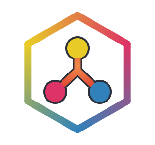
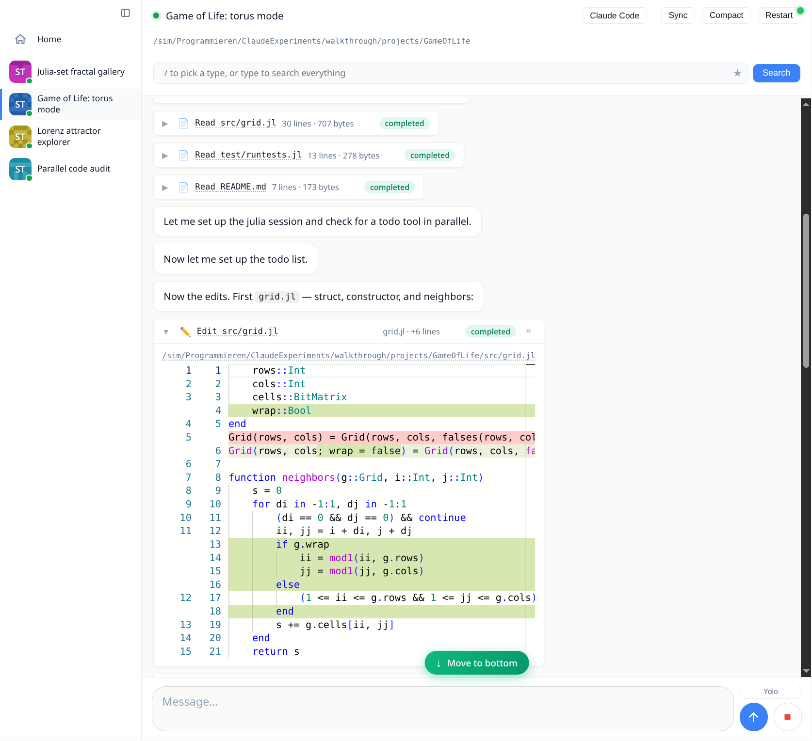

<p align="center">
  <picture>
    <source media="(prefers-color-scheme: dark)" srcset="BonitoAgents/assets/logo/bonitoagents-dark.svg">
    
  </picture>
</p>

<h1 align="center">BonitoAgents</h1>

<p align="center">
  A self-hosted dashboard for running coding agents on your own machines.
</p>

> [!WARNING]
> Use at your own risk: there are no safeguards (yet) preventing an LLM driven
> through BonitoAgents from wiping your entire PC or leaking all your secrets.

<p align="center">
  
</p>

A small worker process runs on every machine that has code on it. All workers
connect out to one dashboard server, and you control every agent session from
a single web UI, from any browser including your phone. Nothing runs in a
cloud; the agents work directly on your checkouts with your Claude
subscription.

```
   browser / phone ──HTTP/WS──▶  dashboard server (Bonito web app)
                                      ▲  ▲
                     control WS +     │  │
                     file transfer    │  │
                          ┌───────────┘  └───────────┐
                     worker (laptop)             worker (desktop)
                     ├─ claude-code agent (ACP)  ├─ agent per project
                     ├─ persistent Julia MCP     ├─ …
                     └─ your project checkouts   └─ your project checkouts
```

Agents are pluggable [ACP](https://agentclientprotocol.com) providers:
Claude Code by default, with MiMo and OpenCode adapters included
([`AgentProviders/`](AgentProviders/)).

## Features

- Chats stream in live, with Monaco diff viewers for edits, terminal output
  for shell commands, inline images, and the agent's todo list pinned while
  it works.
- A file tree and Monaco editor per project. Files open fresh from the
  worker and save back to it. Panels (chats, editors, app embeds) arrange
  into tabs, splits and floating windows.
- Agents get MCP tools backed by a persistent Julia session per project:
  `julia_eval` with warm state and disciplined output, `bt_show` for media,
  and `bt_show_app` to embed a running Bonito app whose interactions round
  trip to Julia on the worker.
- Chats persist on disk, browser reconnects resume where you left off, and
  existing Claude Code sessions on a worker can be imported with their
  history.
- Dropped or half-open worker connections (suspend, network switch) are
  detected by heartbeats on both ends and heal automatically.

The full inventory lives in [`FEATURES.md`](FEATURES.md).

## Quick start

### Install (Linux / macOS)

```bash
curl -fsSL https://raw.githubusercontent.com/SimonDanisch/BonitoAgents.jl/main/install.sh | sh
```

### Install (Windows, PowerShell)

```powershell
irm https://raw.githubusercontent.com/SimonDanisch/BonitoAgents.jl/main/install.ps1 | iex
```

This downloads the prebuilt bundle for your machine (a self-contained Julia +
BonitoAgents, no separate Julia install needed), puts a `bonito-agents` command
on your PATH, and immediately starts the desktop app: a local dashboard server
plus a worker for this machine, opened in your browser. Everything runs on your
box; nothing is sent to a cloud.

Afterwards, start it any time with:

```bash
bonito-agents
```

Re-run the same install line to **auto-update** to the newest release (it skips
the download when you are already current). State persists across restarts and
updates under the platform data dir (`~/.local/share/BonitoAgents` on Linux,
`~/Library/Application Support/BonitoAgents` on macOS,
`%LOCALAPPDATA%\BonitoAgents` on Windows) and is never touched by updates.
Useful flags: `bonito-agents --port=8038`, `--no-window`, `--data-dir=PATH`;
`… | sh -s -- --no-run` to install without starting, `--uninstall` to remove
(the raw bundles are also attached to
[releases](https://github.com/SimonDanisch/BonitoAgents.jl/releases)).

For Claude Code agents you also need Node 20+,
`npm install -g @anthropic-ai/claude-code @agentclientprotocol/claude-agent-acp`,
and a logged-in `claude`.

### From source

```bash
git clone https://github.com/SimonDanisch/BonitoAgents.jl
cd BonitoAgents.jl
julia --project=BonitoAgentsApp -e 'using Pkg; Pkg.instantiate()'
julia --project=BonitoAgentsApp -m BonitoAgentsApp
```

Requires [Julia](https://julialang.org/install/) 1.12+. Same result as the
installer: dashboard server + local worker + UI in your browser.

### One server, many machines

Run the server somewhere always reachable. With the installer above it is just
the `server` mode of the same command:

```bash
bonito-agents server --host=0.0.0.0 --port=8038
```

(from a source checkout:
`julia --project=BonitoAgentsApp -m BonitoAgentsApp server --host=0.0.0.0 --port=8038`)
or install it as a systemd service with
[`BonitoAgents/assets/install_server.sh`](BonitoAgents/assets/install_server.sh).
Then, on each machine that should run agents, paste the one-liner from the
dashboard's home screen:

```bash
curl -fsSL http://<your-server>:8038/install.sh | sh
```

It installs the worker pinned to the server's code revision, registers the
machine under a stable identity, and sets up a systemd user service on
Linux. Re-run it any time to update.

## Tour

<p align="center">
  
</p>

[`examples/walkthrough.jl`](examples/walkthrough.jl) records a scripted tour
([`examples/walkthrough.mp4`](examples/walkthrough.mp4)) against a
deterministic mock agent, so it needs no API key:

```bash
julia --project=BonitoAgents/test examples/walkthrough.jl
```

## Documentation

Getting started, concepts, deployment and API docs live in [`docs/`](docs/):

```bash
julia --project=docs -e 'using Pkg; Pkg.instantiate()'
julia --project=docs docs/make.jl
julia --project=docs docs/run.jl        # serve the built site locally
```

## Development

```bash
julia --project=BonitoAgents -e 'using BonitoAgents; BonitoAgents.wait!(dev_server(auto_open = true))'
```

`dev_server()` boots the same stack against throwaway tempdirs. The test
suite drives it through headless Electron:

```bash
julia --project=BonitoAgents -e 'using Pkg; Pkg.test("BonitoAgents")'                          # everything
julia --project=BonitoAgents -e 'using Pkg; Pkg.test("BonitoAgents"; test_args=["unit"])'      # fast, no browser
julia --project=BonitoAgents -e 'using Pkg; Pkg.test("BonitoAgents"; test_args=["e2e:media"])' # one suite
```

## Security model

Workers authenticate to the server with a shared secret from the install
one-liner. The dashboard has no user accounts, so keep it on localhost, a
VPN, or behind reverse-proxy auth. Agents run with the permissions of the
worker process; the chat's permission prompts and the Yolo toggle decide how
much they may do unattended.
