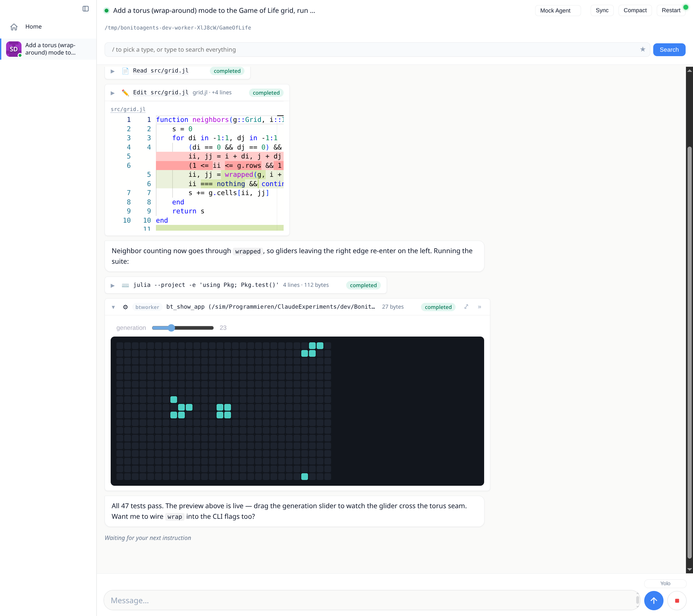
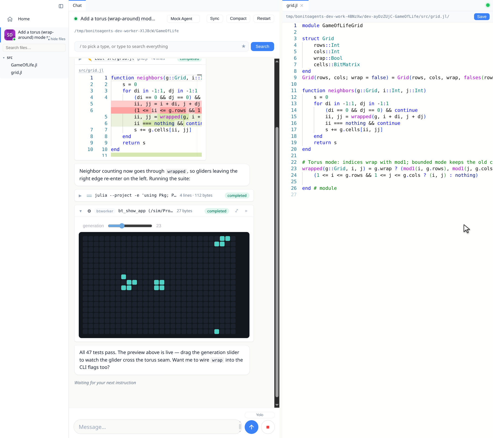

# The Chat

## The transcript

Agent turns stream live. The transcript is a virtualized scroller, so
month-long conversations stay smooth: only the visible window is in the DOM,
history backfills lazily in the background, and your reading position is
anchored to *content*, so it survives tab switches, reconnects, and messages
growing above the viewport.

- **Prose** renders as CommonMark with syntax-highlighted code blocks. Code
  blocks and images grow hover buttons for copy and download; images open in
  a lightbox on click.
- **Tool calls** appear as one-line pills (icon, title, status) that expand
  in place: file edits into a Monaco diff viewer, shell commands into
  scrollable terminal output, searches into match lists.
- **Julia evals** (`bt_julia_eval`) stream their stdout into a live terminal
  pane while they run, then settle into Code and Output sections that each
  collapse three ways (full → a scrollable ~4-line summary → hidden). The
  return value renders below as a live result, an interactive app included
  (see [Julia Tools & Live Apps](@ref)).
- **Questions** (ACP elicitations) render as forms you answer inline.
- **Plans and todo lists** the agent maintains are pinned to the taskbar while
  the turn runs.
- **Subagents** (for example Claude Code's Task tool) get their own activity
  feed inside the parent pill, including output that arrives *between* turns
  from background subagents.

While a turn streams, the view follows the newest message; scroll up and it
stops following, with a "move to bottom" control and an unread indicator until
you return. Sending is never blocked: messages typed during an agent restart
or reconnect are queued rather than dropped.

## Files and the editor

Every file path in the transcript is a link, and the sidebar has a lazy,
searchable project file tree (hover a chat, then "▾ files"). Opening a file
fetches it fresh from the worker, so the editor always shows what is on disk
now, and puts it in a Monaco editor panel that saves back to the worker
(`Ctrl+S`). Re-activating an already-open file re-checks the worker and
live-updates a clean buffer; your unsaved edits are never overwritten.

## The workspace

The main area is a VSCode-style workspace
([BonitoWidgets](https://github.com/SimonDanisch/BonitoWidgets.jl)). The chat,
file editors and detached app embeds are panels you drag into tab groups,
split horizontally or vertically, float as windows, and dock back. Collapse the
sidebar (`Ctrl`/`⌘`+`B`) for a full-bleed view. The layout is responsive: on a
phone the sidebar folds to icons and panels stack, so the same dashboard drives
a chat from your desk or your pocket.

## Media and live apps

Agents push results into the chat through the built-in Julia tools
([Julia Tools & Live Apps](@ref)). `bt_show` renders a worker-side file: images
and videos inline with a lightbox, text as syntax-highlighted code. And
whatever `bt_julia_eval` **returns** renders as a live value: a plot, a table,
or a running Bonito app whose logic executes in the worker's Julia session, so a
slider drag or button click round trips to real code. Live embeds detach from
their bubble into a workspace tab or floating window and stay alive there: the
same DOM node is moved, so their WebGL context and session are kept rather than
rebuilt.

## Staying in control

- **Stop** interrupts the current turn; a hung agent escalates (cancel, then
  force-close) so stop always works.
- **Yolo mode** (composer toggle) auto-continues an agent that pauses to ask
  "shall I keep going?". The reminder it injects also tells the agent how to
  bail out deliberately.
- **Compact** asks the agent to summarize the conversation so far into a fresh
  context, after which the transcript reconciles cleanly.
- **Background tasks** (long test runs, builds) stay pinned to the taskbar
  with live line counts and a per-task stop button, monitored across turns
  until their writer exits.
- The **search lens** (`/` box above the transcript) filters the transcript by
  type or fuzzy text, and saved lenses come back on a click.
